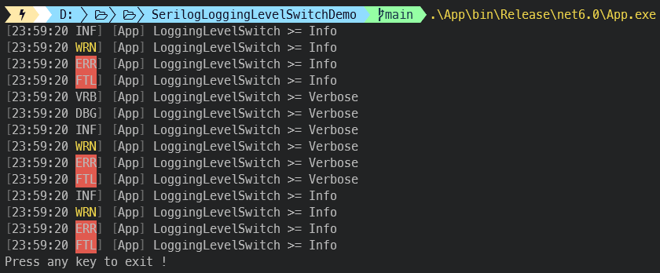

[](https://github.com/aimenux/SerilogLoggingLevelSwitchDemo/actions/workflows/ci.yml)

# SerilogLoggingLevelSwitchDemo
```
Using LoggingLevelSwitch in order to change the serilog level in the fly
```

In this demo, i m using a nice serilog feature [LoggingLevelSwitch](https://nblumhardt.com/2014/10/dynamically-changing-the-serilog-level/) in order to change the serilog level in the fly.
>
> :writing_hand: This feature may be useful when we want to have more detailed logs in some places of our code based on some runtime behaviour (condition, exception, etc).
>
> :writing_hand: This feature can be used either when serilog is configured with fluent api or via json file section (set ConfigType to either Fluent or Json in appsettings.json).
>



**`Tools`** : vs22, net 6.0, serilog
